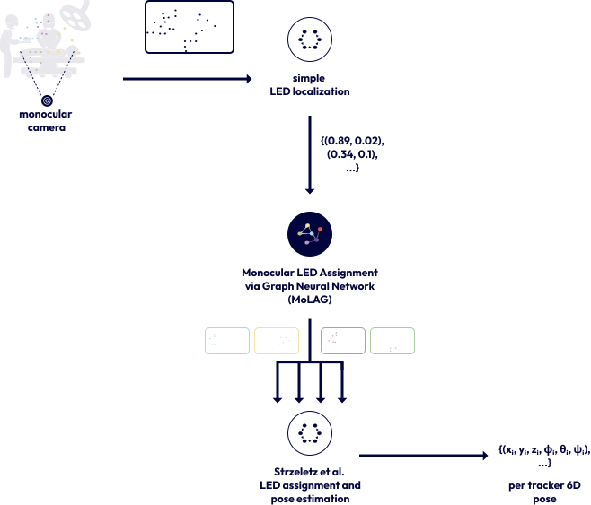
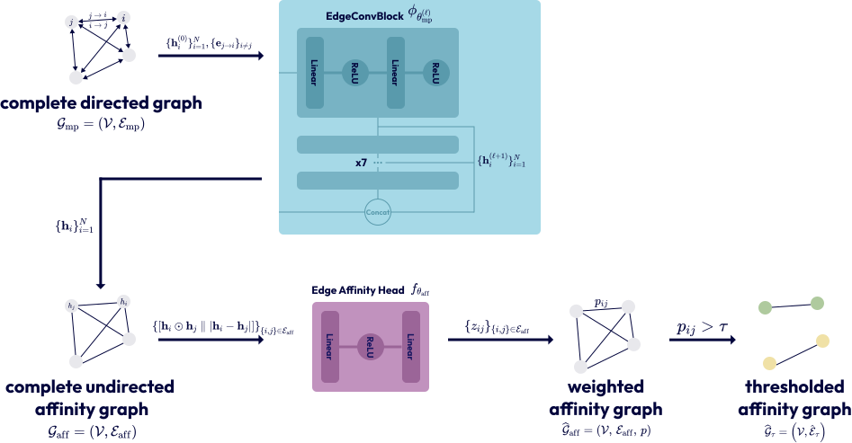

---
hide:
  - navigation
  - toc
---

# MoLAG

MoLAG learns pairwise same-tracker affinities for a scene-wide set of localised LED
points. Thresholding these affinities partitions the detections into candidate tracker
groups for subsequent geometry-specific processing.

<div class="homepage-actions" markdown>

[Understand the method](method/index.md){ .md-button .md-button--primary }
[Reproduce the workflow](guides/reproduction.md){ .md-button }

</div>

{ .homepage-figure width="620" }

## Coordinate-level input

MoLAG consumes unordered 2D points from an upstream LED-localisation stage. It does
not require raw images or a hand-crafted marker template.

## Structured affinity learning

A complete graph and symmetric edge head model the relations among all detections. A
modular loss enforces tracker connectivity, separation, and spurious-point handling.

## Reproducible evaluation

Typed configurations, frozen evaluation datasets, held-out threshold calibration,
prediction caches, and provenance records keep every result traceable.

## From detections to candidate tracker groups

{ .homepage-figure }

MoLAG is a preprocessing stage for multi-tracker surgical navigation. The evaluated
configuration uses generated coordinate scenes modelling missing LEDs, spurious
detections, and localisation noise. The output groups restrict the candidate search
presented to a downstream geometry-specific assignment and pose-estimation procedure.

!!! note "Scope"
    The included experiments evaluate grouping on generated coordinate-level scenes.
    They do not constitute an end-to-end pose-estimation or camera-image validation.

## Start with a complete run

```bash
git clone https://github.com/yannikheizmann/MoLAG.git
cd MoLAG
uv sync --frozen

uv run --frozen finetune --config experiments/molag_finetune.yaml
uv run --frozen evaluate --config experiments/molag_evaluate.yaml
```

The supplied experiment files record the model, training, calibration, and evaluation
settings. See the [reproduction guide](guides/reproduction.md) for frozen dataset
generation and metric recomputation.
