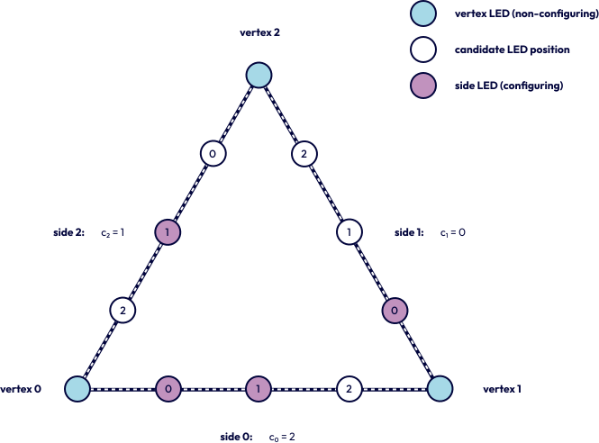

# Method overview

MoLAG assigns unordered localised LED points to candidate tracker groups. Given a set
of two-dimensional coordinates, it constructs a complete directed graph, predicts a
symmetric same-tracker affinity for every unordered point pair, and extracts connected
components after thresholding.

The formulation is geometry-agnostic: supervision supplies same-tracker labels rather
than a marker template. Training for another tracker geometry requires representative
data for that design. The implementation retains interfaces for tracker definitions,
loss components, and evaluation metrics to support such extensions.

The evaluated configuration uses the triangular seven-LED tracker shown below. It has
27 valid code configurations; this geometry defines the study configuration, not the
general MoLAG interface.

{ width="520" }

The method is organised into four stages:

1. Generate coordinate-level scenes and model localisation errors.
2. Encode the complete point graph with EdgeConv message passing.
3. Learn pairwise affinities with the scaled-conjunction loss.
4. Calibrate a threshold on held-out scenes and extract connected components.
