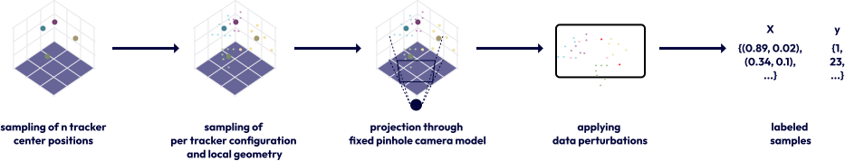

# Synthetic data

Training samples model the coordinate sets returned by an upstream LED-localisation
stage. Trackers are sampled in three dimensions, projected through a monocular camera
model, and modified to represent missing LEDs, coordinate noise, and spurious light
points.

The standard dataset specification is stored in
`src/molag/dataset/profiles/molag_standard.yaml`. A dataset profile describes the
scene distribution and can be copied alongside output artifacts. Dataset size and
split-specific seeds are supplied separately by the typed command configuration.

Frozen calibration and test datasets are generated once and stored as YAML. Each
sample seed then identifies a deterministic scene, avoiding a large duplicated data
export while preserving exact evaluation inputs.
